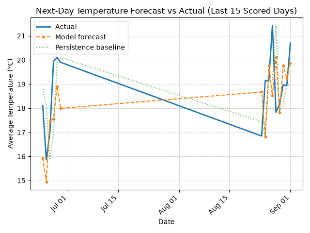
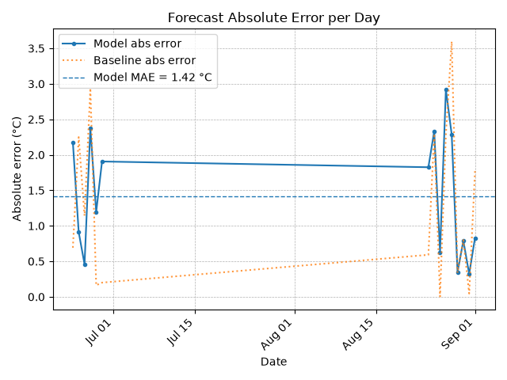

# City Conditions ETL Pipeline

A fully automated end-to-end ETL pipeline that pulls daily weather and air quality data for **Toronto, Canada**, loads it into a DuckDB analytics warehouse, and publishes KPI reports and charts updated every day via GitHub Actions.

---

## Data Sources

All data is pulled from **[Open-Meteo](https://open-meteo.com/)** — a free, open-source weather and air quality API requiring no API key.

| Source | API | Data Collected |
|---|---|---|
| Weather | [Open-Meteo Forecast API](https://api.open-meteo.com/v1/forecast) | Temperature (C), Precipitation (mm), Wind Speed (km/h) |
| Air Quality | [Open-Meteo Air Quality API](https://air-quality-api.open-meteo.com/v1/air-quality) | PM2.5, PM10, NO2, Ozone |

---

## Latest KPI Snapshot

- Date: **2026-09-01**
- Avg Temp (C): **20.7**
- Max Temp (C): **23.2**
- Total Precip (mm): **0.0**
- Avg Wind (km/h): **9.95**
- Max Wind (km/h): **16.4**
- PM2.5 Avg (ug/m3): **26.09**
- PM2.5 Peak (ug/m3): **43.1**

---

## Next-Day Forecast (model output)

- Forecast for **2026-09-02**: **19.88 °C** average temperature
- Persistence baseline ("same as today"): 20.7 °C
- Model: RidgeCV on 8 engineered features, trained on 30 observed days
- Seasonal (day-of-year) features are **disabled** until the history covers most of a year — with partial coverage they extrapolate badly

### Accuracy (walk-forward backtest)

Every forecast below was made using only data available *before* the day it predicts — no future information leaks into training.

| Metric | Model | Persistence baseline |
|---|---|---|
| MAE (°C) | **1.42** | 1.274 |
| RMSE (°C) | **1.652** | 1.697 |
| Days scored | 15 | 15 |

**Skill score vs persistence: -11.5%** — currently not yet beating the baseline. Skill is the share of the baseline's error the model removes; it is published whether it is positive or negative.





---

## Charts (auto-updated daily)

### Weather

- **Average Temperature (C):** daily mean temperature


- **Total Precipitation (mm):** total precipitation per day


### Air Quality

- **PM2.5 (ug/m3):** daily average fine particulate concentration (smaller = cleaner air)


---

## How It Works

| Step | What happens |
|---|---|
| Extract | Pulls 7 days of hourly weather and air quality from Open-Meteo (observations only — `forecast_days=0`, so the API's own forecast never enters the observation tables) |
| Transform | Cleans and validates: parses timestamps, nulls physically impossible values, deduplicates |
| Load | Upserts into a DuckDB warehouse, keyed on (location_id, ts) so re-runs are idempotent |
| History | Appends observed daily aggregates to `data/history/daily_observations.csv` — the durable record the model trains on |
| Predict | Fits a RidgeCV model on lagged daily features, forecasts the next day, and scores every past forecast walk-forward |
| Report | Generates KPI CSV, 30-day charts, forecast charts, and rewrites this README |
| Log | Appends a row to reports/run_log.csv |

---

## Tech Stack

| Technology | Purpose |
|---|---|
| Python | ETL scripting |
| DuckDB | Analytics warehouse |
| pandas | Data transformation |
| requests | API extraction |
| matplotlib | Chart generation |
| scikit-learn | Forecasting model (RidgeCV) and validation |
| pytest | Test suite |
| GitHub Actions | Daily automation and CI |

---

## Outputs

- `data/history/daily_observations.csv` — **the durable observation record.** Append-only, committed on every run, and what the forecasting model trains on
- `warehouse/city_conditions.duckdb` — DuckDB warehouse, rebuilt from the API's rolling window each run (a derived artifact, not the system of record)
- `reports/latest_kpis.csv` — most recent daily KPI snapshot
- `reports/predictions.csv` — every forecast ever published, with the raw model output and whether sanity bounds were applied
- `reports/prediction_backtest.csv` — per-day walk-forward scores: prediction, actual, and baseline
- `reports/prediction_metrics.csv` — MAE / RMSE / skill history over time
- `reports/run_log.csv` — log of every pipeline run
- `reports/charts/*.png` — auto-generated 30-day charts

---

## Tests

```bash
pip install -r requirements-dev.txt
pytest -q
```

The suite covers transform invariants, the no-leakage-across-calendar-gaps property of the feature builder, and regression tests for both extrapolation guards — including the literal 40 °C forecast this pipeline once published.

---

## How to Run Locally

```bash
git clone https://github.com/Data-Netrunner/City-Conditions-ETL-Pipeline.git
cd City-Conditions-ETL-Pipeline
pip install -r requirements.txt
python etl/run_weather_pipeline.py
```

No API keys or paid services required.

---

*Built by Andre Felix - Data updated daily via GitHub Actions*
