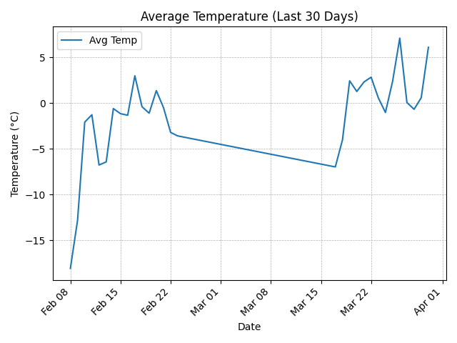
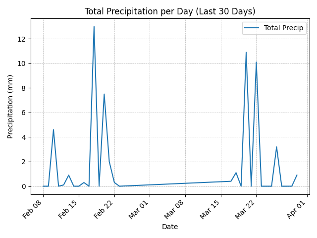
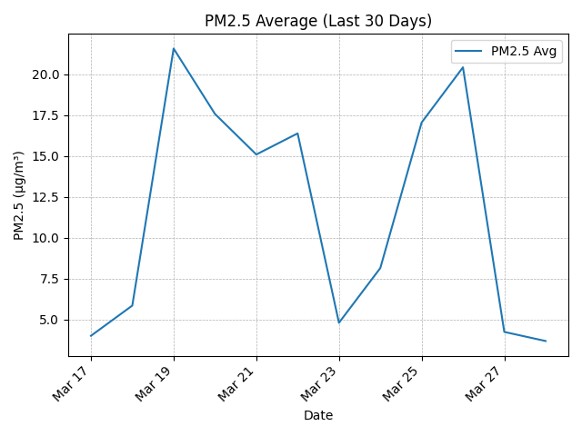

# City Conditions ETL (Daily)

Automated end-to-end ETL pipeline that pulls daily-updating **weather + air quality** data, loads it into a DuckDB analytics warehouse, and publishes KPI reports + charts.

## Latest KPI snapshot

- Date: **2026-03-30**
- Avg Temp (°C): **6.08**
- Max Temp (°C): **10.2**
- Total Precip (mm): **0.9**
- Avg Wind (km/h): **21.16**
- Max Wind (km/h): **33.9**
- PM2.5 Avg (µg/m³): **NA**
- PM2.5 Peak (µg/m³): **NA**

## Charts (auto-updated)

**How to read these:**
- X-axis is **date** (last 30 days)
- Y-axis shows the **measured unit** for that chart (°C, mm, µg/m³)
- Values are **daily aggregates** computed from hourly data in the warehouse

### Weather

- **Average Temperature (°C):** daily mean temperature

- **Total Precipitation (mm):** total precipitation accumulated per day

### Air Quality

- **PM2.5 (µg/m³):** daily average fine particulate concentration (smaller = cleaner air)

## Outputs

- `warehouse/city_conditions.duckdb`
- `reports/latest_kpis.csv`
- `reports/charts/*.png`
